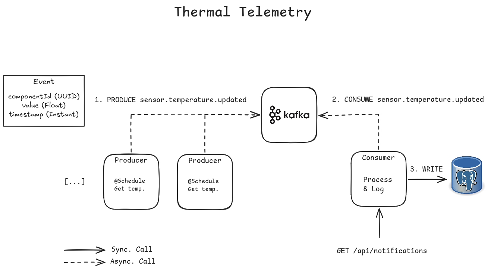
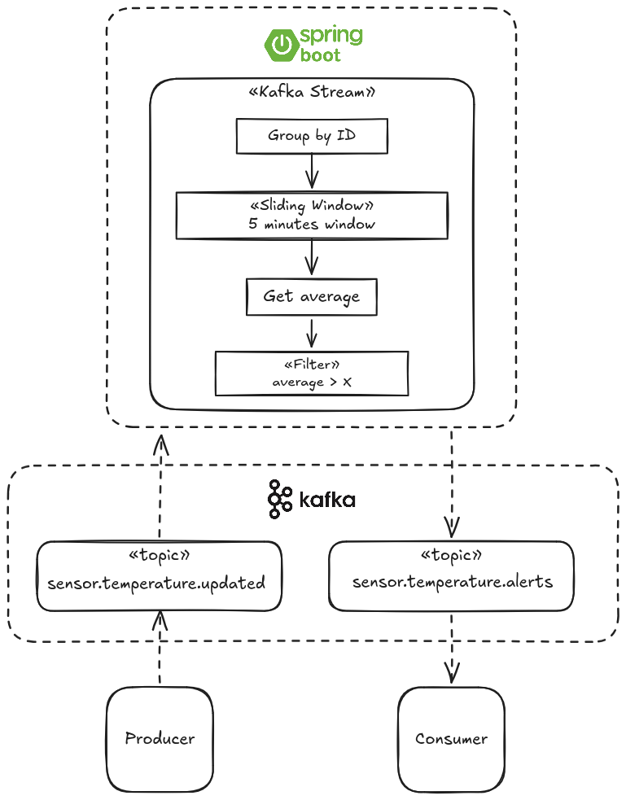
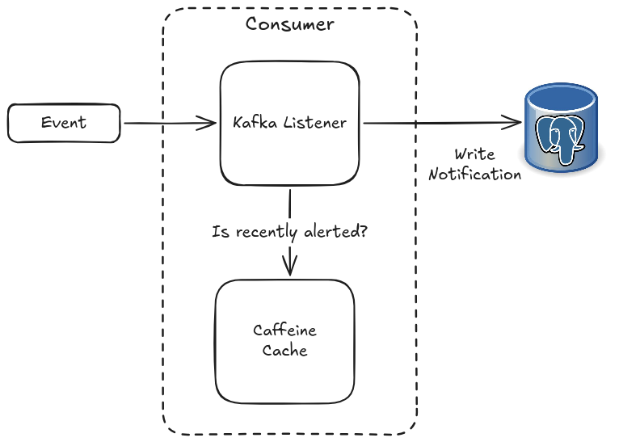

# Spring Kafka Sandbox

Study project implementing Apache Kafka using Spring Boot 4.


## Technologies

- Java 21
- Spring Boot 4.1
- Caffeine Cache
- PostgreSQL 17
- Apache Kafka 3.8 (KRaft)
- KafkaUI
- Docker

## Domain

The purpose is to create a simples IoT simulation with constant events and analytics.



### Telemetry Analytics Stream



### Consumer

The consumer handles alert events with cache-based TTL using Caffeine. If the has already been alerted within the last 5 minutes, the notification is ignored.



## How to execute

1. Start all services

```bash
docker compose up -d --build
```

- KafkaUI will be available on `http://localhost:8081`.
- Notifications will be available on `http://localhost:8080/api/notifications`